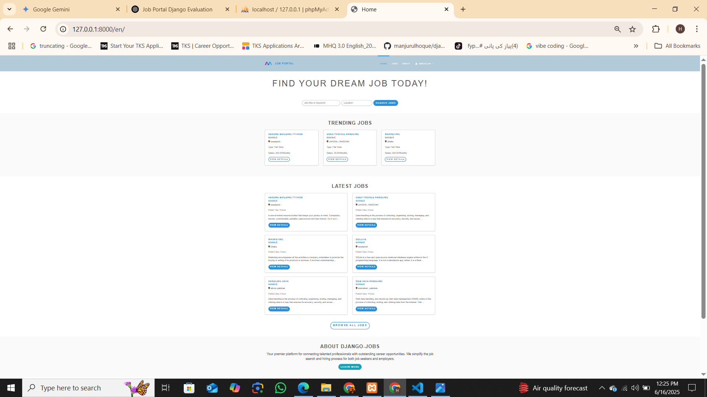
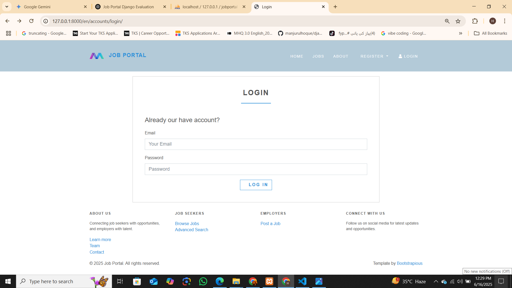
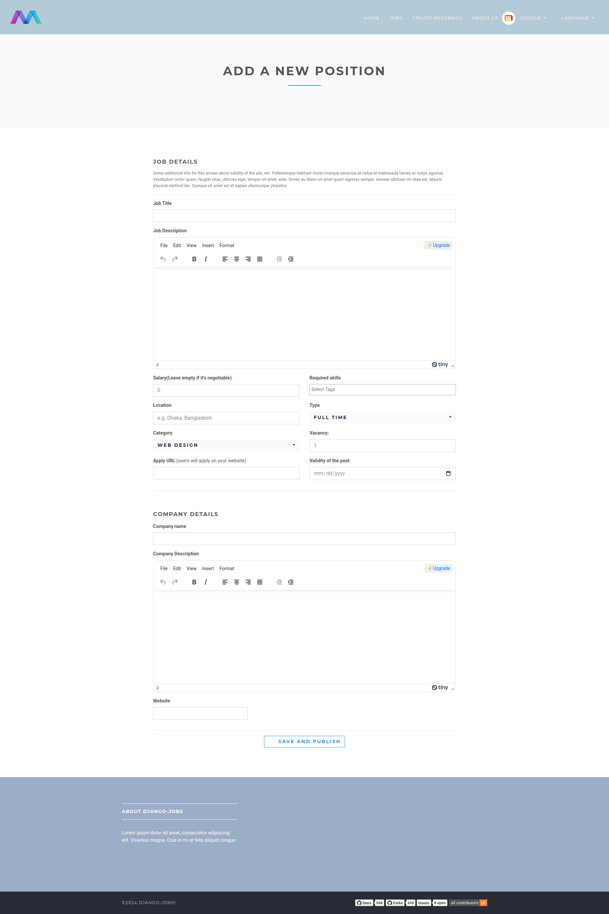
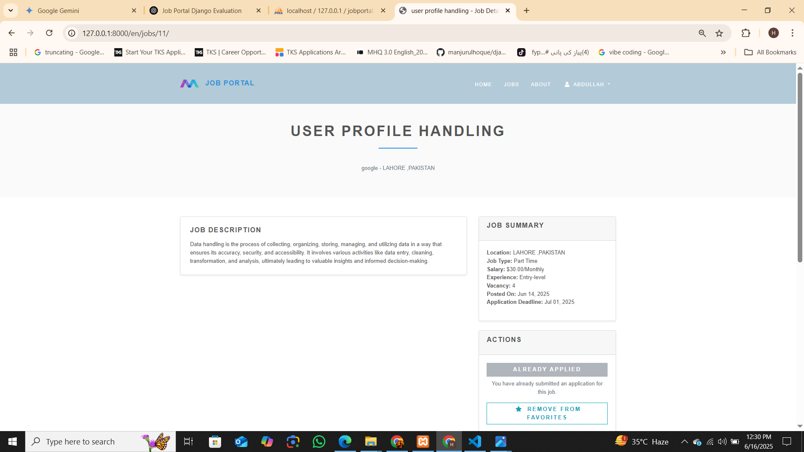

<div align="center">


# Django Job Portal

</div>

## Django Job Portal

A fully functional job portal built using Django and MySQL.

Live demo not available.

---

### 🛠 Used Tech Stack

1. Django
2. MySQL

---

### 📸 Screenshots

#### 🏠 Home Page


#### 🔐 Login Page


#### ➕ Add New Position as Employer


#### 📄 Job Details


---

<a name="local-venv"></a>
### ⚙️ Local Environment Setup

#### 📥 Install

1. Create a virtual environment

    ```bash
    python -m venv venv
    ```

2. Activate it

    - Windows:
      ```bash
      venv\Scripts\activate
      ```
    - macOS/Linux:
      ```bash
      source venv/bin/activate
      ```

3. Clone the repository and install the packages in the virtual env:

    ```bash
    pip install -r requirements.txt
    ```

4. Add `.env` file (if required).

5. Add your MySQL configuration inside `settings.py` or through `.env`.

---

#### 🚀 Run

1. With the venv activated, run:

    ```bash
    python manage.py migrate
    ```

2. Run server:

    ```bash
    python manage.py runserver
    ```

3. Default Django admin credentials:

    - **Email**: `hell@gmail.com`
    - **Password**: `12345`

---

#### 🧪 Run tests

```bash
python manage.py test
